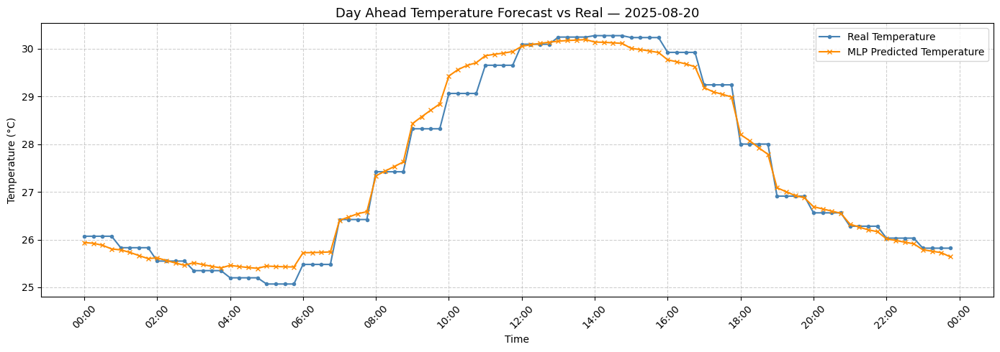
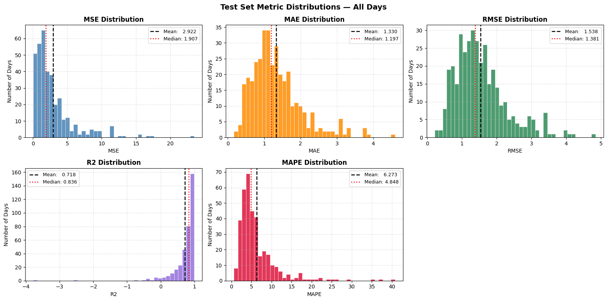

# Time Series Temperature Forecasting
This is a simple MLP (Multilayer Perceptron) model designed to predict next day's temperature.

## Architecture: 
``` 17 → 32 → 16 → 1```

## X parameters:
* hour
* minute	
* dayofweek	
* dayofyear	
* month	
* year	
* slot	
* slot_sin 
* slot_cos
* dow_sin
* dow_cos
* doy_sin
* doy_cos
* lag_1day
* lag_2day
* lag_3day
* lag_7day
* season
* year_index

## y parameter:
* Temperature

## Optimization Techniques used:
* Dropout (p=0.3)
* Weight decay= 1e-4
* Batch Size = 128

## Resulting temperature forecast for 2023-08-20:


## Resulting temperature forecast for 2023-02-05:


## Error distribution for every day in the test set:


